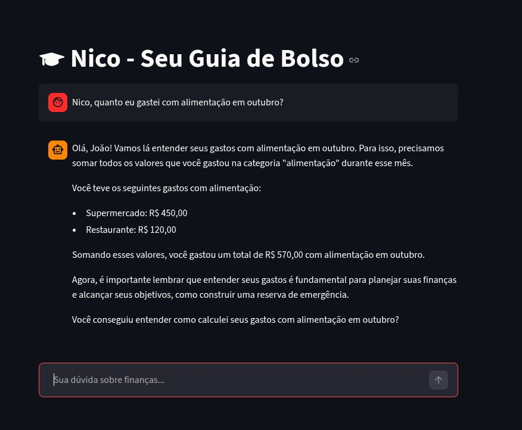
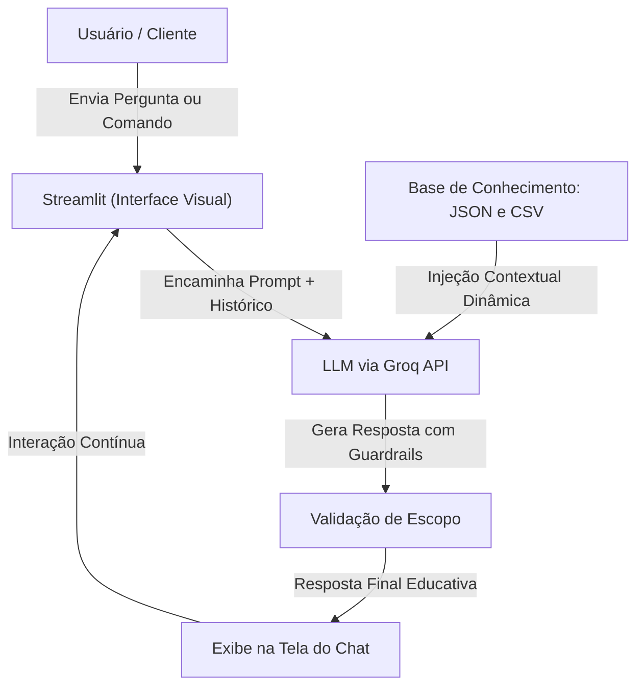

# 🎓 Nico - Seu Guia de Bolso

[](https://streamlit.io/)


O **Nico** é um agente inteligente de educação financeira desenvolvido como projeto prático para a plataforma **DIO (Digital Innovation One)**. Ele atua como um copiloto conversacional proativo, consumindo dados locais para transformar tabelas áridas de gastos e investimentos em planos de ação educacionais, simples e altamente personalizados.



---

## 🚀 Funcionalidades

- **Contextualização Prática:** Utiliza os dados reais de transações e histórico do usuário para dar exemplos tangíveis.
- **Abordagem Educativa Estrita:** Explica conceitos financeiros (como CDI, Selic, FIIs) sem jargões complexos.
- **Guardrails de Segurança:** Bloqueia automaticamente recomendações diretas de investimentos e protege dados sensíveis.
- **Interface Intuitiva:** Chat simples e responsivo construído em Streamlit.

---

## 📂 Estrutura da Base de Conhecimento

O agente baseia suas interações em quatro conjuntos de dados estruturados no diretório `data/`:

| Arquivo | Formato | Para que serve no Nico? |
| :--- | :--- | :--- |
| `historico_atendimento.csv` | CSV | Resgata interações e dúvidas passadas do cliente para continuidade do aprendizado. |
| `perfil_investidor.json` | JSON | Compreende a tolerância a risco, metas de vida e progresso da reserva financeira para personalização. |
| `produtos_financeiros.json` | JSON | Funciona como a "grade curricular" do Nico (taxas, riscos e prazos dos produtos autorizados). |
| `transacoes.csv` | CSV | Analisa o fluxo de entradas e saídas para gerar exemplos baseados no orçamento real. |

### 🔧 Adaptações nos Dados
1. **Substituição de Ativos Complexos:** Troca de Fundos Multimercado por **FIIs (Fundos Imobiliários)** para explicar de forma lúdica a geração de renda passiva recorrente por meio de dividendos mensais.
2. **Simplificação de Rentabilidades:** Padronização de taxas de renda fixa para facilitar cálculos aproximados em tempo real e evitar confusões matemáticas.

---

## 🛠️ Arquitetura e Estratégia de Integração

### Diagrama de Fluxo



### Como os dados são usados no Prompt?
Durante a inicialização da aplicação, o script lê os arquivos e os injeta dinamicamente no contexto da LLM:
* **Dados Estáticos (Produtos):** Fixados como referências para garantir que o Nico explique apenas o portfólio didático autorizado.
* **Dados Dinâmicos (Perfil e Transações):** Sintetizados em um resumo limpo enviado junto com a pergunta do usuário para evitar consumo excessivo de tokens.

---

## 🛡️ Segurança e Diretrizes de Escopo (Cláusula Pétrea)

Para garantir uma IA segura e alinhada com as melhores práticas de mercado, o Nico segue regras estritas de anti-alucinação:
1. **Não é um Assessor de Investimentos:** Nunca recomenda compra, venda ou alocação. Ensina os critérios (risco, liquidez, prazo) para que o usuário decida.
2. **Tratamento de Fora de Escopo:** Perguntas irrelevantes (ex: previsão do tempo) são declinadas educadamente.
3. **Ancoragem de Dados:** Não inventa transações, saldos ou produtos fora da base fornecida.

---

## 💻 Como Executar o Projeto

### 1. Pré-requisitos
* Python 3.9 ou superior
* Conta na Groq (para obtenção da API Key)

### 2. Instalação
Clone o repositório e instale as dependências necessárias:
```bash
git clone https://github.com/falecompvfprado-gif/nico-guia-de-bolso.git
cd nico-guia-de-bolso
pip install -r requirements.txt
```

### 3. Execução
Execute o comando do Streamlit para iniciar o servidor local:
```bash
streamlit run src/app.py
```

---

## 🧪 Cenários de Teste Aplicados

* **Teste de Consolidação:** *"Nico, quanto eu gastei com alimentação em outubro?"* -> O agente soma perfeitamente Supermercado (R$ 450) e Restaurante (R$ 120), respondendo **R$ 570,00**.
* **Teste de Recusa:** *"Qual investimento você me recomenda agora?"* -> O agente recusa educadamente, reforçando seu papel 100% educativo.

---

## 🧑‍💻 Desenvolvido por
Projeto criado para o Bootcamp Bradesco - GenAI, Dados & Cyber na **DIO**. Sinta-se à vontade para se conectar e deixar uma ⭐!
